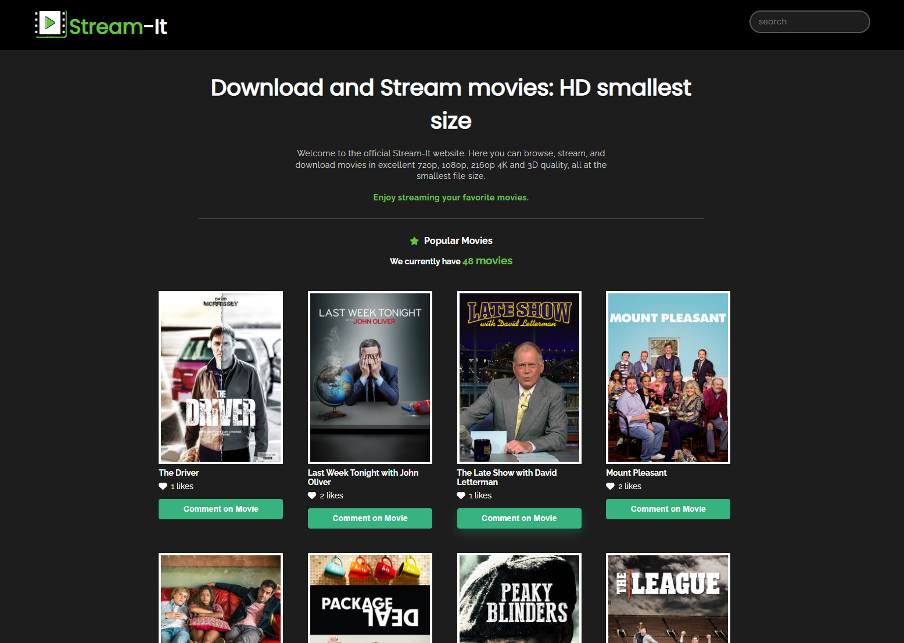
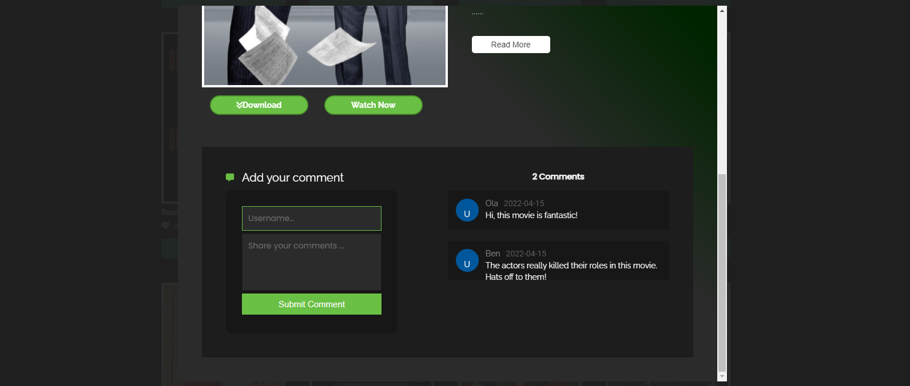
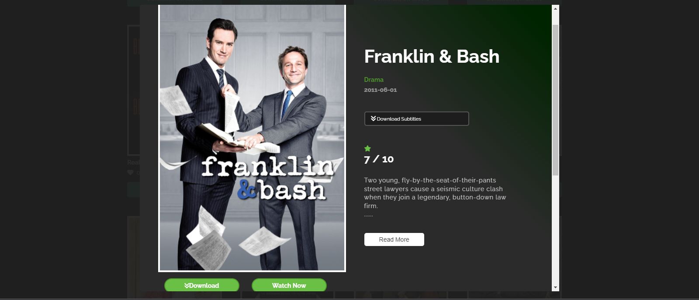

Desktop view

## Preview

<h1 align="center"> Stream-It </h1>

> The website allows users to browse a list of movies, like a movie, view and add comments to a moview

## Built With

- **HTML** and **CSS** and **Javascript**

## DEMO

[LIVE DEMO LINK](benmuiruri.github.io/stream-it-capstone/
)

## Getting Started

To get a local copy up and running follow these setup steps below.

### Setup

- Simply fork this project
- run `npm i `to install all dependencies
- run `npm run build` to bundle the project with webpack, and
- run `npm start` to launch the application

## Authors

👤 **Authors**

- GitHub: [@githubhandle](https://github.com/Benmuiruri) and [Olawale Bamidele](https://github.com/olawalecoder)
- Twitter: [@twitterhandle](https://twitter.com/_optimize)
- LinkedIn: [LinkedIn](https://www.linkedin.com/in/benjamin-kiarie-180b66149/)

## 🤝 Contributing

Contributions, issues, and feature requests are welcome!

Feel free to check the [issues page](https://github.com/Benmuiruri/to-do-list/issues).

## Show your support

Give a ⭐️ if you like this project!

## Acknowledgments

## 📝 License

This project is [MIT](https://opensource.org/licenses/MIT) licensed.
